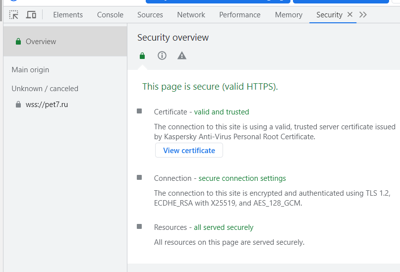
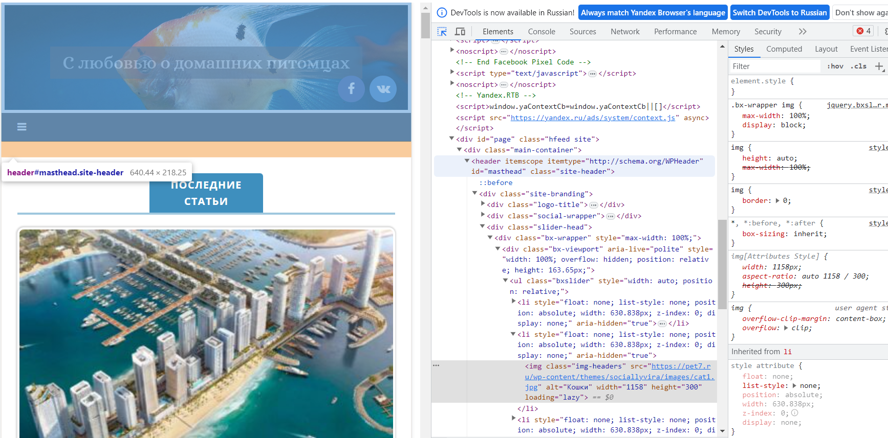
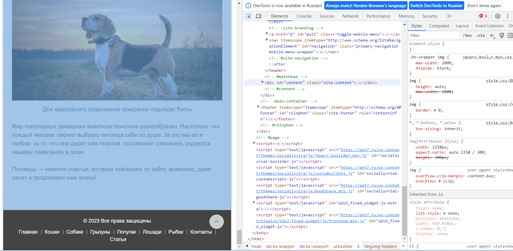
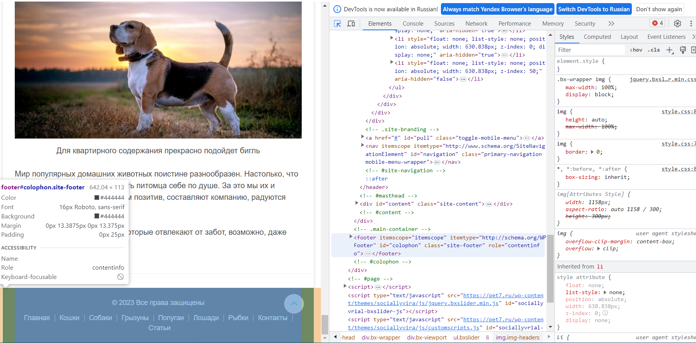
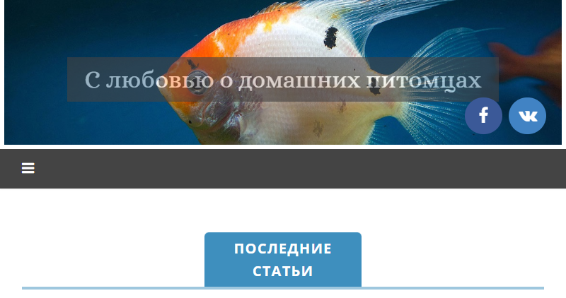
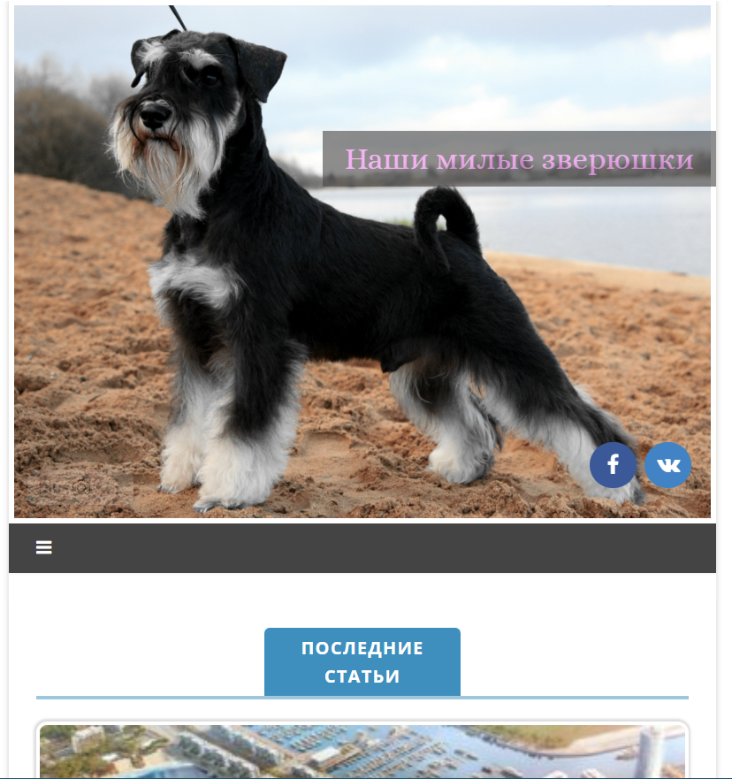
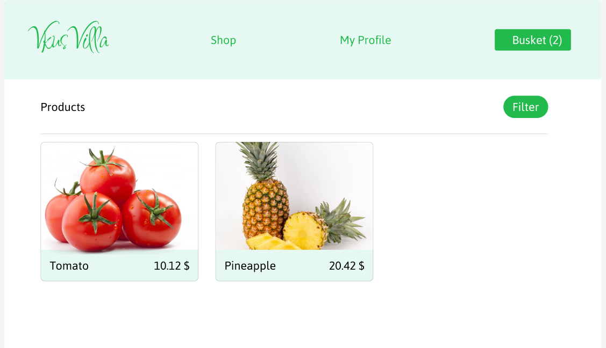
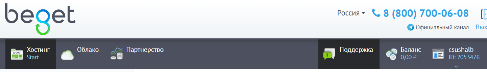

# Задача 1
1. На основе сайта <https://pet7.ru/> определите, на каком протоколе работает сайт.

	Протокол https.

	

2. Проанализируйте структуру страницы сайта. Покажите в коде где хедер, футер и контент.
	
	* Header

	

	* Content

	
	
	* Footer

	

3. Внесите не менее 3 изменений на страницу с помощью инструмента разработчика и представьте скриншоты было/стало.

	* Было

	
	
	* Стало

	

4. Создайте прототип низкой детализации.

	

5. Зарегистрируйтесь на хостинге.

	